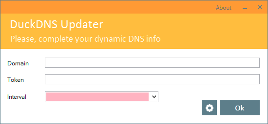
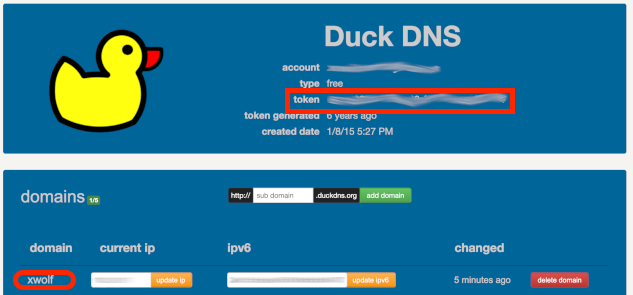
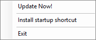
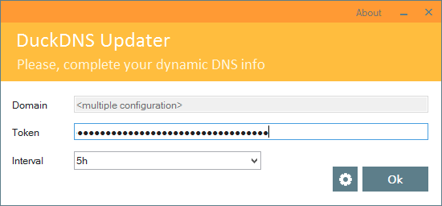
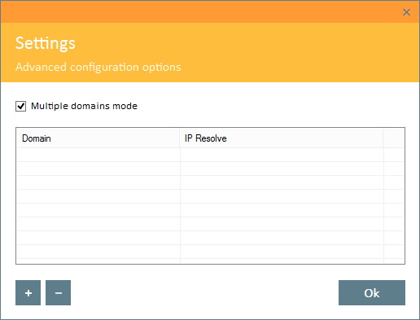
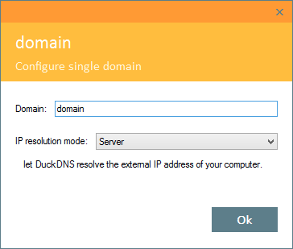

# DuckDNS Windows Client by XWolfOverride
A simple DuckDNS updater for Windows in C#

This updater tries to be easy to use and ready for advanced users.

## Easy mode

Initial screen.

The first time the updater opens shows this screen where you can set the token and the domain.

Get both data from your Duck DNS account webpage:

Set the update interval from the list or write your own.

Clicking OK will sve the configuration, hide as Tray icon / Notification area and makes an update call with the configuration.

## Updater status
The Tray icon have 3 status:
Yellow:  indicates all is right and updates are correct.
Blue:  indicates that an update call is being processed.
Red:  indicates some error updating domains.

In the red case a balloon will appear with information about the error.

## Tray icon options

Double click on tray icon will show the configuration dialog.

Click with the secondary mouse button will show a menu with tree options:

Update Now! > Forces a domain update round and reset intervals.
Install Startup Shortcut > Creates a shortcut to start the updater on at boot.
Exit > Closes DuckDNS updater.

## Advanced mode

Main screen in advanced mode.

For more configuration options use the gear button and enable the multi domains mode.

Settings screen.

Add and remove domains in the list with the buttons at the bottom left and double click for edition.

## Domain item edition

Domain editor screen.

In this screen you can edit the domain name and the IP resolution technique.

* Server:

	The IP resolution will be done by DuckDNS server, is the more common way to get the external IP of the machine.

* Local:

	The updater resolves the computer network IP configuration.

* Fixed:

	A simple fixed IP address, not really useful for a dynamic DNS but canbe used for testing and temporal configuration.

* Host

	The updater resolves the IP based on a host name.
	
	The address depends on the network configuration.
	
* WebService

	Prior to updating the address on DuckDNS a GET call tho the web service is done, and the IP returned on this service will be used.
	
	The url path can be a file path useful for local programs.
